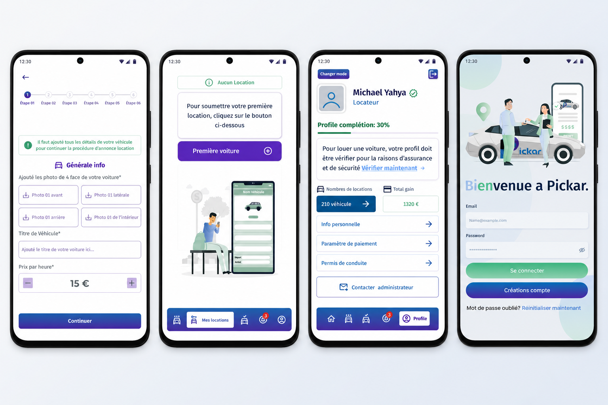

<div align="center">
  <h1>🚗 PickCar</h1>
  <p><strong>A Modern Peer-to-Peer Car Sharing & Rental Platform Built with Flutter</strong></p>

  <p>
    <a href="https://flutter.dev"></a>
    <a href="https://dart.dev"></a>
    <a href="https://opensource.org/licenses/MIT"></a>
  </p>

  
  &nbsp;&nbsp;&nbsp;&nbsp;
  
</div>

---

## 📖 About The Project

**PickCar** is an innovative and scalable mobile application designed to revolutionize the way people rent and share cars. Acting as a peer-to-peer marketplace, it bridges the gap between car owners who want to monetize their idle vehicles and users who need reliable, affordable transportation.

Built with a strong focus on user experience, performance, and security, PickCar offers an intuitive interface, real-time map integration, and robust local data management.

### The Problem It Solves
Traditional car rentals can be expensive and cumbersome. PickCar empowers local communities by allowing individuals to rent vehicles directly from their neighbors, ensuring lower costs, greater convenience, and a wider variety of vehicles to choose from.

---

## ✨ Key Features

### 👤 For Users (Renters)
- **Seamless Onboarding:** Quick login and registration secured by phone number verification.
- **Interactive Map Discovery:** Find cars near your location instantly using interactive maps (`flutter_map`).
- **Comprehensive Listings:** View high-quality images, read detailed vehicle specifications, and check community ratings.
- **Easy Booking:** Send rental requests directly to car owners with a few simple taps.
- **Booking Management:** Track the status of your requests and view your rental history in real-time.

### 🚘 For Hosts (Car Owners)
- **List Your Vehicle:** Easily upload photos and details of your car to start earning.
- **Request Management:** Approve or decline incoming rental requests via a dedicated dashboard.
- **Rental Tracking:** Keep a close eye on your active and past rentals.

### 🛡 Core App Capabilities
- **Profile & Document Verification:** Securely upload and manage driving licenses and personal information.
- **Offline Reliability:** Lightning-fast local data caching via **Hive**, ensuring smooth performance even on poor networks.
- **Dynamic UI:** Smooth animations, loading shimmers, and interactive widgets provide a premium feel.

---

## 🏗 Architecture & Tech Stack

This project is built using industry-standard architectures and modern Flutter packages to ensure maintainability and scalability.

* **UI Framework:** [Flutter](https://flutter.dev/) (Dart)
* **State Management:** [BLoC (flutter_bloc)](https://bloclibrary.dev/) - Ensuring predictable state changes and clean separation of business logic from the UI.
* **Local Storage:** [Hive](https://docs.hivedb.dev/) - A lightweight, blazing-fast key-value database written in pure Dart.
* **Networking:** `http` for robust RESTful API communication.
* **Mapping & Geolocation:** `flutter_map` combined with `latlong2`.
* **UI/UX Components:** 
  * `google_nav_bar` for modern bottom navigation.
  * `shimmer` for elegant loading skeleton states.
  * `easy_stepper` for intuitive multi-step forms.
  * `carousel_slider` for interactive image galleries.

---

## 🚀 Getting Started

Follow these instructions to get a copy of the project up and running on your local machine for development and testing purposes.

### Prerequisites

* [Flutter SDK](https://docs.flutter.dev/get-started/install) (`>=3.3.4 <4.0.0`)
* Dart SDK
* An IDE such as [Android Studio](https://developer.android.com/studio), [IntelliJ IDEA](https://www.jetbrains.com/idea/), or [VS Code](https://code.visualstudio.com/).
* iOS device/simulator requires a Mac with Xcode installed.

### Installation

1. **Clone the repository**
   ```bash
   git clone https://github.com/yourusername/PickCar.git
   ```

2. **Navigate to the directory**
   ```bash
   cd PickCar
   ```

3. **Install dependencies**
   ```bash
   flutter pub get
   ```

4. **Run the app**
   ```bash
   # For Android/iOS simulators or connected devices
   flutter run
   ```

---

## 📂 Project Structure

The codebase is organized modularly to promote readability and scalability:

```text
lib/
├── DataClass/          # Data models, entities, and JSON serialization
├── Tools/              # Reusable helper functions, constants, and configurations
├── view/               # UI Layer (Screens and Pages)
│   ├── Home/           # Main dashboard and map integration
│   ├── Login/          # Authentication flows
│   ├── MesVoiture/     # Host dashboard for managing listed cars
│   ├── MesLocation/    # Renter dashboard for tracking active rentals
│   ├── profile/        # User profile and settings
│   └── ...
├── widgets/            # Globally shared UI components (buttons, navbars, cards)
└── main.dart           # Application entry point and initialization
```

---

## 🤝 Contributing

Contributions are what make the open-source community such an amazing place to learn, inspire, and create. Any contributions you make are **greatly appreciated**.

1. Fork the Project
2. Create your Feature Branch (`git checkout -b feature/AmazingFeature`)
3. Commit your Changes (`git commit -m 'Add some AmazingFeature'`)
4. Push to the Branch (`git push origin feature/AmazingFeature`)
5. Open a Pull Request

---

## 📄 License

Distributed under the MIT License. See `LICENSE` for more information.
